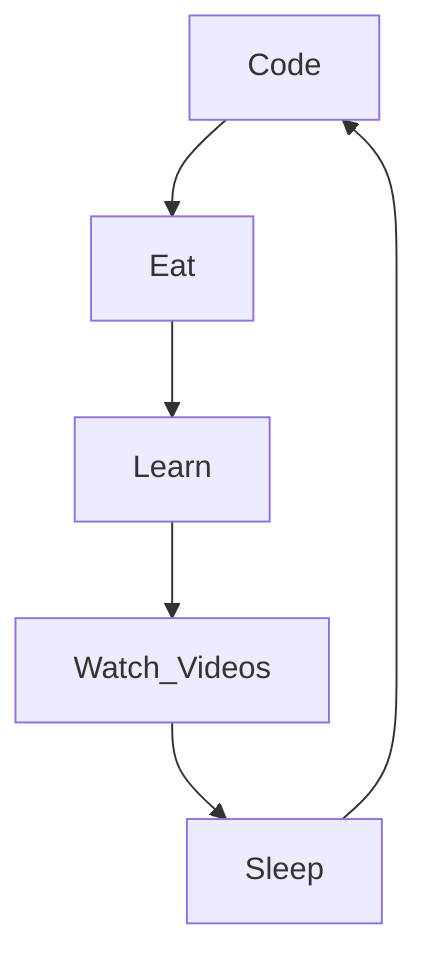

# Abdoul Aziz

<h1 align="center">
  
</h1>

  

## About Me

I'm Abdoul Aziz, a junior Java developer based in Conakry – a vibrant and dynamic city. Passionate about continuous learning, I constantly explore new programming languages and frameworks to tackle new challenges. Currently, I specialize in **Java** and **SpringBoot**, and I'm always looking for opportunities to grow my skills and work on innovative projects.

<!--
**KingAbdoul/KingAbdoul** is a ✨ _special_ ✨ repository because its `README.md` (this file) appears on your GitHub profile.
-->

## Contact Me

- 📧 [Gmail](https://mail.google.com/mail/?view=cm&fs=1&to=abdoulaziz22.d@gmail.com)
- 🔗 [My LinkedIn Profile](https://www.linkedin.com/in/abdoul-aziz-diallo-828a40305)

## Technologies and Tools

  
  
  
  
  
  
  
  
  
  
  

## My Daily Routine

### ⭐ GitHub Stats

## Interests

- 🎥 I love watching anime
- 📚 I enjoy reading
- 🎶 I'm a huge fan of music

## Current Projects & Learning

- 🚀 I’m currently improving my skills in Java and SpringBoot.
- 🔍 I am also exploring new tools and frameworks to expand my expertise.
